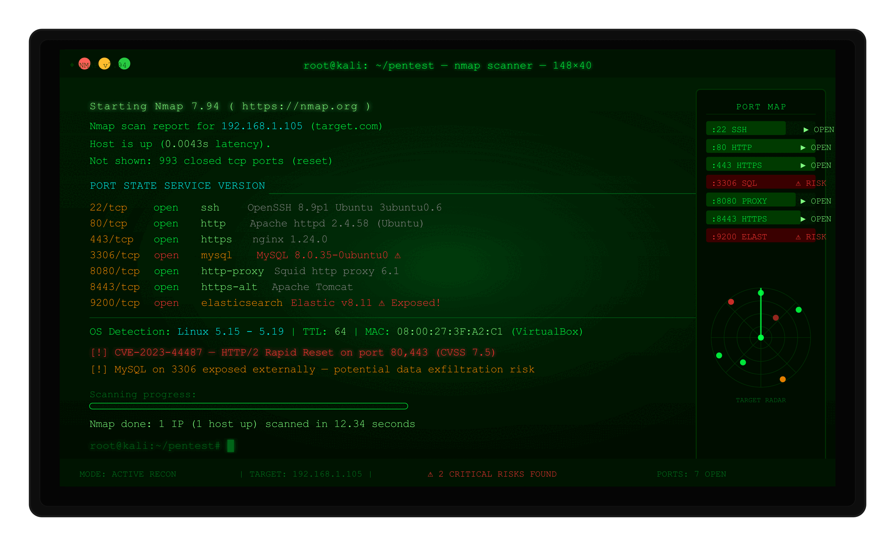

# 🔍 Recon Checklist — Penetration Testing Reconnaissance Guide

> A structured, hands-on guide for performing active and passive reconnaissance during penetration tests. Designed for ethical hackers, security researchers, and CTF players.

---

> ⚠️ **Disclaimer:** This guide is intended **strictly for authorized penetration testing and educational purposes only**. Unauthorized scanning or enumeration of systems you do not own or have explicit permission to test is **illegal**. Always obtain written authorization before performing any recon activities.

<div align="center">
  
  <p align="center">
    <b>Figure: Demo </b>
  </p>
</div>

---

## 📖 Table of Contents

- [Active Recon Overview](#active-recon-overview)
- [1. Nmap Scanning](#1-nmap-scanning)
- [2. DNS Enumeration](#2-dns-enumeration)
- [🛠️ Tools Deep Dive](#️-tools-deep-dive)
  - [theHarvester](#theharvester)
  - [Recon-ng](#recon-ng)
- [📋 Recon Checklist](#-recon-checklist)

---

## Active Recon Overview

> **Active recon** involves direct interaction with the target system. Unlike passive recon (OSINT), active techniques **leave traces in server logs** and may trigger IDS/IPS alerts. Always ensure you are authorized before proceeding.

---

## 1. Nmap Scanning

Nmap is the most essential tool for active reconnaissance — used for port scanning, service detection, OS fingerprinting, and script-based enumeration.

### Common Nmap Commands

```bash
# Fast scan — top 1000 ports
nmap -F target.com

# Full port scan — all 65535 ports
nmap -p- target.com

# Service and version detection
nmap -sV target.com

# OS detection + scripts + version (aggressive)
nmap -A target.com

# Stealth SYN scan (less noisy)
nmap -sS target.com

# Default script scan
nmap -sC target.com

# Full comprehensive scan with output saved
nmap -sV -sC -A -p- target.com -oN output.txt
```

### What to Note From Results

| Finding | Why It Matters |
|---|---|
| Open ports | Reveals what services are running |
| Software versions | Search for associated CVEs |
| OS type | Helps plan exploitation strategy |

---

## 2. DNS Enumeration

DNS enumeration uncovers subdomains and DNS records that reveal infrastructure details about the target.

### DNS Record Types

| Record | Meaning |
|---|---|
| `A` | Domain → IPv4 address |
| `MX` | Mail servers |
| `NS` | Name servers |
| `TXT` | SPF, DMARC, verification records |
| `CNAME` | Domain aliases |

### Commands

```bash
# Basic DNS lookup
nslookup target.com

# Query all DNS records
dig target.com ANY

# A record (may return CDN IP like Cloudflare, not real origin)
dig A target.com

# MX record — mail servers often reveal real IPs
dig MX target.com

# TXT records — SPF and DMARC policy info
dig TXT target.com
```

### Subdomain Enumeration

```bash
# Gobuster DNS brute-force
gobuster dns --domain target.com \
  -w /usr/share/wordlists/seclists/Discovery/DNS/subdomains-top1million-110000.txt \
  -t 50 --timeout 5s -o result.txt

# Automated subdomain discovery
subfinder -d target.com
amass enum -d target.com
```

### High-Value Subdomains to Target

```
dev.target.com       → Development servers (often less hardened)
staging.target.com   → Staging environments
admin.target.com     → Admin panels
vpn.target.com       → VPN endpoints
mail.target.com      → Mail servers
api.target.com       → API endpoints
```

---

## 🛠️ Tools Deep Dive

### theHarvester

Automates OSINT collection — gathers emails, subdomains, IPs, and employee names from public sources.

```bash
# Install (pre-installed on Kali Linux)
pip install theHarvester

# Basic usage with specific source
theHarvester -d target.com -b google
theHarvester -d target.com -b linkedin

# Use all available sources
theHarvester -d target.com -b all

# Save output to HTML file
theHarvester -d target.com -b all -f output.html
```

**What it finds:** Emails · Subdomains · IP addresses · Employee names

---

### Recon-ng

A full-featured reconnaissance framework — like Metasploit, but built for OSINT and recon.

```bash
# Step 1 — Search for available modules
marketplace search hackertarget

# Step 2 — Install the module
marketplace install recon/domains-hosts/hackertarget

# Step 3 — Load the module
modules load recon/domains-hosts/hackertarget

# Step 4 — Set the target domain
options set SOURCE target.com

# Step 5 — Execute
run

# View collected results
show hosts
show contacts
```

### Useful Recon-ng Modules

| Module | Purpose |
|---|---|
| `recon/domains-hosts/hackertarget` | Find subdomains |
| `recon/domains-contacts/whois_pocs` | WHOIS contact info |
| `recon/hosts-hosts/resolve` | Resolve hostnames to IPs |

---

## 📋 Recon Checklist

Use this checklist during real-world penetration tests to ensure thorough coverage.

### 🔓 Passive Recon (No Direct Target Interaction)

- [ ] WHOIS lookup completed
- [ ] Google dorking completed
- [ ] Shodan search done
- [ ] LinkedIn employees noted
- [ ] Email addresses collected
- [ ] Subdomains found (passive)
- [ ] Old website versions checked (Wayback Machine)
- [ ] Breach data checked (Have I Been Pwned)
- [ ] Job postings analyzed for tech stack clues

### 🔴 Active Recon (Direct Interaction — Leaves Logs)

- [ ] Nmap full port scan completed
- [ ] Service versions noted
- [ ] DNS records enumerated
- [ ] Zone transfer attempted
- [ ] Subdomains brute-forced
- [ ] All findings documented

---

## 📚 Recommended Wordlists & Resources

- [SecLists](https://github.com/danielmiessler/SecLists) — Industry-standard wordlist collection
- [PayloadsAllTheThings](https://github.com/swisskyrepo/PayloadsAllTheThings) — Useful payload reference
- [HackTricks](https://book.hacktricks.xyz) — Technique and exploitation reference

---

## 🤝 Contributing

Pull requests are welcome! If you have additional techniques, tool tips, or checklist items to add, feel free to open an issue or submit a PR.

---

## 📄 License

This project is licensed under the [MIT License](LICENSE).

---

*Happy hacking — ethically.* 🛡️
